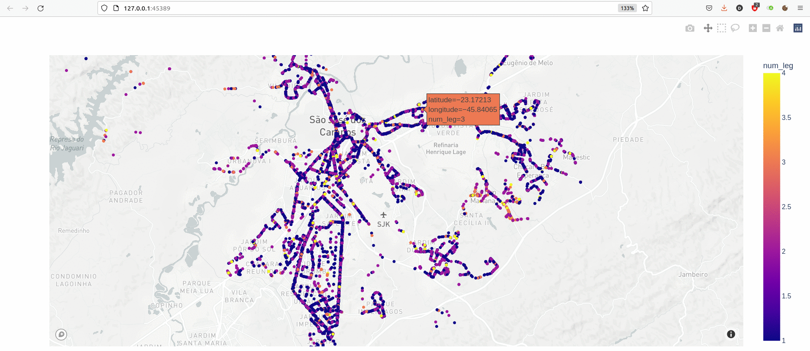

# Transit dataviz examples for São José dos Campos

This is a small example of how to transfom public transit ticketing data into a
higher-level structure, and use the result for easier data visualization.

## Running the code

One-time installation:

1. Install [poetry](https://python-poetry.org), a tool that manages Python
	 dependencies much more reproducibly than `pip`, `conda`, etc
2. Clone the repository: `git clone https://github.com/dabreegster/sjc_trips`
3. Enter the directory: `cd sjc_trips`
4. Install dependencies: `poetry install`

Then you can group any BIL CSV file into journeys by running:

`poetry run python main.py --bil_path ~/Downloads/Sharing_files/Data/bil_2019-09-01.csv`

### Working on the code

To auto-format the code: `poetry run black main.py`

To run the type-checker to detect possible problems: `poetry run mypy main.py`

## Methodology

<!-- start by thinkng about the domain model / structure you have. transform
the raw data into that.

critically, it might not be natural to squeeze it into a table/df. show example
of how to denormalize -- leg_num and total_legs

explicit data structures. dataclasses lightweight in python for now. could
consider protobufs, if you need to save the result efficiently in binary, share
across languages, etc

is this bespoke? how extensible is this approach to other transit agencies with
different format or data? build up pieces based on specific use cases /
problems, share code when appropriate. first transform each custom format into
something kind of standardized -- an example for desire line data -->
